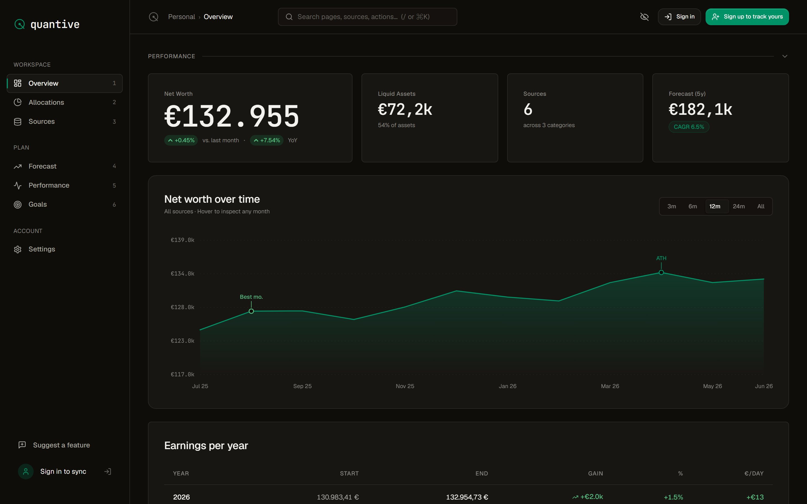
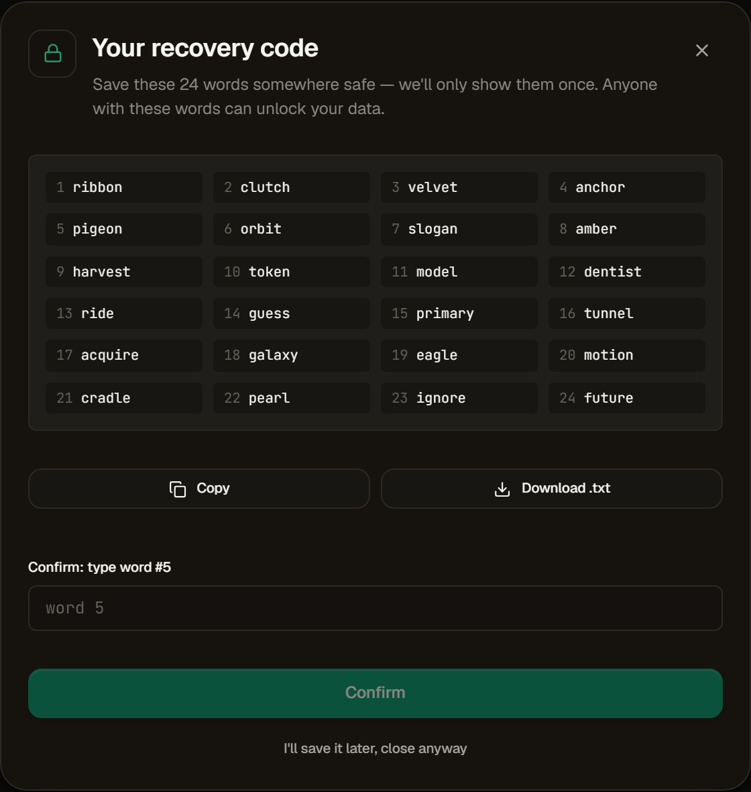

# Quantive

The net-worth spreadsheet you've outgrown. If you track your wealth in a spreadsheet that has sprawled across brokers, banks, and currencies, Quantive replaces it: net worth over time, asset allocation, and a forecast of where it's heading, on any device, with no bank logins to set up. And because it's your money, every byte of portfolio data is encrypted in your browser before it reaches the server.

**Live:** https://usequantive.app · **Try the demo without signing up:** https://usequantive.app/demo



---

## What it replaces

A spreadsheet is where most people start tracking net worth, and for a while it's fine. It stops being fine when the assets pile up: a brokerage in one country, a pension in another, some cash in a third currency, a flat you can only mark to market by hand, a couple of things a bank dashboard will never see. You end up maintaining FX columns and copy-pasting balances once a month, and the sheet you built to give you clarity now just nags at you.

Quantive is that sheet, rebuilt. Enter balances by hand or import them, tag each source by volatility and liquidity, and read your net worth over time, your allocation, and a forecast without rebuilding a single formula. Historical snapshots stay valued at the exchange rate of their original date, so last year's number doesn't drift when today's rates move. There are no bank logins and nothing to connect to an aggregator, which is the point: it tracks the illiquid and cross-border holdings a bank dashboard can't, and it works the same on your laptop and your phone.

---

## Why your data stays yours

This is the reason to pick Quantive over the next spreadsheet replacement. Most finance apps store your data in plaintext on the server. Quantive doesn't.

When you set up an account, a random 256-bit data key (DK) is generated in your browser. That DK is wrapped (encrypted) by a key-encryption key (KEK) derived from your password via **Argon2id** (t=3, m=64 MiB, p=1). The KEK is never stored. It is re-derived on each login. The server only ever receives the wrapped DK and the encrypted snapshot.

```
Password → Argon2id(salt) → KEK
KEK → XChaCha20-Poly1305 → wrapped DK          (stored in user_keys)

DK + random 24-byte nonce → XChaCha20-Poly1305 → encrypted_data  (stored in portfolio_snapshots)
```

This separation matters: changing your password re-wraps the DK under a new KEK, but does not re-encrypt your entire history.

Each ciphertext includes **AAD** bound to your user ID and schema version, so even with full database write access an attacker cannot transplant one user's ciphertext into another's row. The AEAD tag check fails before any plaintext is exposed.

A **24-word BIP-39 mnemonic** serves as a recovery path: a second KEK derived from the mnemonic wraps the same DK, so you can regain access without your password. The mnemonic is shown once and never stored. If you skip it and forget your password, your data is gone by design.

The crypto module (`src/lib/crypto/`) is pure TypeScript, with no I/O and no side effects, and is licensed MIT for independent auditing.



---

## Features

**Free**
- Net worth tracking with unlimited sources
- Full allocation charts by volatility class and liquidity
- Multi-currency display in 13 currencies (EUR, USD, GBP, NOK, SEK, DKK, CHF, CAD, AUD, JPY, PLN, BRL, INR). Historical snapshots are valued at the exchange rate of their original date, not today's
- Spreadsheet import and manual balance entry
- Drawdown and downside stats: maximum drawdown with recovery time, longest decline, best and worst rolling year
- Optional email reminders to update your balances on a schedule you set
- Cloud sync with end-to-end encryption
- Rolling 12-month history view
- Demo mode: the full dashboard without signing up

**Pro (€9/month or €90/year, ~€7.50/mo)**
- Full historical view: every snapshot since you started, charted and as a table
- Net worth projection with a 95% confidence cone. Pick a conservative, base, or optimistic annual rate (5% / 7.2% / 10%); the band is fitted to your own historical variance. The PDF report's forecast instead uses your trailing 3-year CAGR.
- Milestone and goal tracking: targets with progress and ETA
- Benchmark comparison: your net worth against inflation (Eurostat HICP) and the S&P 500 (FRED), with MSCI World coming soon
- Month-by-month summary table
- Excel and CSV export: your full data, any time
- PDF wealth report: a one-page summary for an adviser or an annual review
- Priority support (24h response)

---

## Tech stack

| Layer | Choice |
|---|---|
| Frontend | React 18 + TypeScript 5, Vite 5 (SWC) |
| Routing / state | React Router 6, TanStack Query 5 |
| UI | Tailwind CSS 3 + shadcn/ui + Radix UI |
| Charts | Recharts 2 |
| Animation | Framer Motion 12 |
| Crypto | libsodium-wrappers-sumo (XChaCha20-Poly1305, Argon2id) |
| Backend | Supabase (Postgres + Auth + Edge Functions on Deno) |
| Payments | Stripe |
| Tests | Vitest (unit) + Playwright (E2E) |

---

## Local development

Requires Node.js ≥ 20 (use [nvm](https://github.com/nvm-sh/nvm#installing-and-updating)).

```sh
git clone https://github.com/pedromlsreis/quantive
cd quantive
npm install
cp .env.example .env   # fill in your Supabase keys
npm run dev            # the dev server runs on http://localhost:8080
```

**.env.example**
```
VITE_SUPABASE_URL=https://<project-id>.supabase.co
VITE_SUPABASE_PUBLISHABLE_KEY=<anon-key>
VITE_POSTHOG_KEY=          # optional, analytics
VITE_POSTHOG_HOST=         # optional, e.g. https://eu.i.posthog.com
```

---

## Scripts

```sh
npm run dev           # dev server
npm run build         # production build
npm run preview       # preview production build locally
npm run typecheck     # tsc --noEmit (must pass before PRs)
npm run lint          # ESLint (zero errors required)
npm run test          # unit tests via Vitest (~20 s, crypto-heavy)
npm run test:watch    # watch mode
npm run test:e2e      # Playwright headless
npm run test:e2e:ui   # Playwright with interactive UI
npm run test:all      # unit + E2E
```

All four gates must pass before a pull request is mergeable: `lint`, `typecheck`, `test`, `build`.

---

## Project structure

```
src/
├── lib/crypto/       # Pure crypto module (MIT): AEAD, KDF, recovery, key wrapping
├── lib/              # forecast, fxConvert, dataProcessor (Excel parser), types
├── contexts/         # Auth, Portfolio, KeySession, Currency, Preferences
├── pages/            # Dashboard, Allocations, Forecast, Sources, Settings, Admin
├── components/       # charts/, dashboard/, auth/, layout/, ui/ (shadcn)
└── hooks/

supabase/
├── migrations/       # forward-only SQL migrations
└── functions/        # Deno edge functions: Stripe webhook, FX ingest, admin APIs
```

---

## Legal and policy pages

`docs/legal/{impressum,privacy-policy,terms-of-service}.md` are the canonical source for the rendered Impressum, Privacy and Terms pages. They are imported via `?raw` by [`src/components/legal/MarkdownLegal.tsx`](src/components/legal/MarkdownLegal.tsx) and rendered with ReactMarkdown. Edit the markdown, not the React page.

---

## Security

Found a vulnerability? Please report it privately. See [SECURITY.md](SECURITY.md).

Crypto patches must reference the relevant section of `docs/security/encryption.md` by heading. New crypto primitives or parameter changes require a written rationale.

---

## License

Quantive is **source-available**, not OSI-approved open source. The application code is released under the [PolyForm Noncommercial 1.0.0](LICENSE) licence; the crypto module (`src/lib/crypto/`) is released under the MIT licence. Commercial use requires a separate licence: contact <legal@usequantive.app>.
